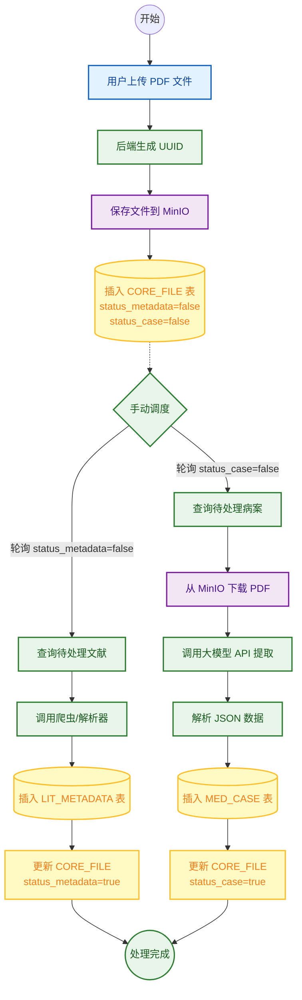
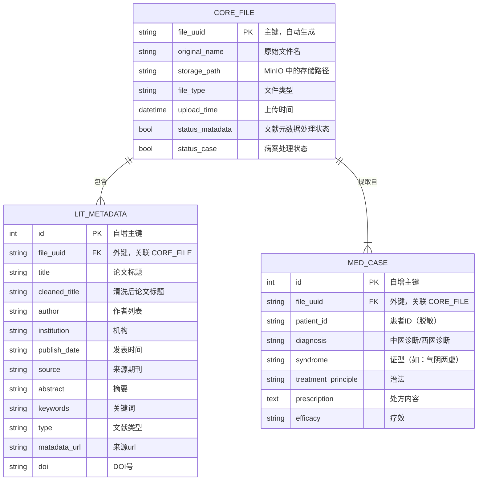

# 中医大模型智能体与知识图谱平台（TCM-Agent Graph Platform）

**TCM-Agent** 融合 **数据处理**、**知识图谱呈现** 与 **Agent 智能对话** 三大能力，面向中医领域的高价值知识抽取与智能问答。

**核心业务痛点**：将海量非结构化的中医文献与临床病案自动化提炼为结构化医疗实体，通过知识图谱进行可视化串联，并最终由 Agent 对话系统为医生/科研人员提供智能问答与辅助诊疗。

**技术栈**：Python、FastAPI、AntV G6、PostgreSQL、MinIO、Docker、LLM（大模型）。

## 核心业务数据流（Data Workflow）

**阶段一：数据处理层（Data Processing）**
1. 用户上传文档至 MinIO
2. 触发后台解析流程
3. 调用大模型抽取中医实体
4. 结构化结果写入 PostgreSQL 核心表
5. 通过 ETL 脚本建模生成图谱底表（Nodes/Edges）




**阶段二：KG 图谱应用层（Knowledge Graph）**
1. FastAPI 后端提供图数据检索与 BFS 扩展接口
2. 前端 AntV G6 实现交互式高亮渲染与节点探索

**阶段三：Agent 对话系统（Agent Dialogue System）**
1. 基于大模型与RAG进行语义增强
2. 提供自然语言对话界面
3. 支持病案溯源、智能问答与关联分析

---

## 项目目录与架构映射（Directory Structure）

```
.
├── UI                              # 用户界面
│   ├── backend                     # 后端
│   │   ├── app
│   │   └── scripts
│   └── frontend                    # 前端
│       └── src
├── agent                           # agent
├── configs
│   ├── nginx
│   └── sql
├── data_process                    # 数据处理
│   ├── case_metadata               # 病案元数据提取
│   ├── lit_metadata                # 文献元数据提取
│   └── pdf_upload                  # 文件上传建立数据库
└── docker                          # docker配置文件

```

### Git 协作与分支规范

**主干分支模型**：`main` / `master` 作为稳定主干，功能开发通过特性分支合并。

**分支命名规则**：
- `feat/agent-xxx`
- `feat/data-xxx`
- `feat/kg-xxx`
- `fix/agent-xxx`
- `fix/kg-xxx`

**Conventional Commits 提交规范**：

```
<type>(<scope>): <subject>
```

示例：
- `feat(agent): add dialogue router`
- `fix(kg): handle bfs pagination`
- `chore(infra): update docker compose`

常用 type：`feat`、`fix`、`chore`、`docs`、`refactor`、`test`。

## 数据库建模

