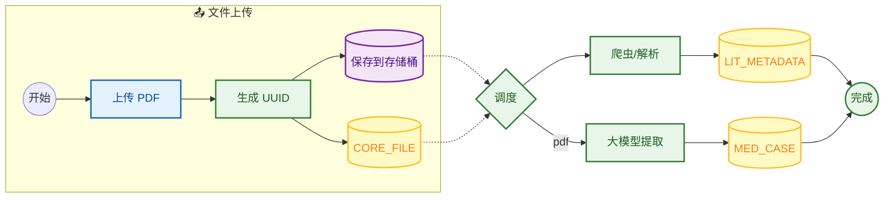
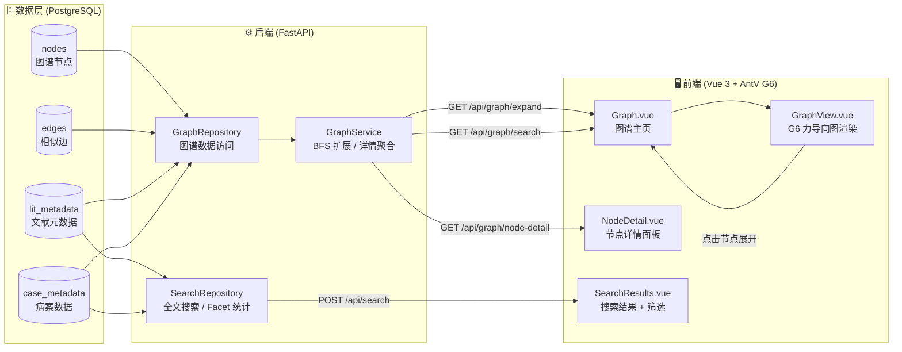
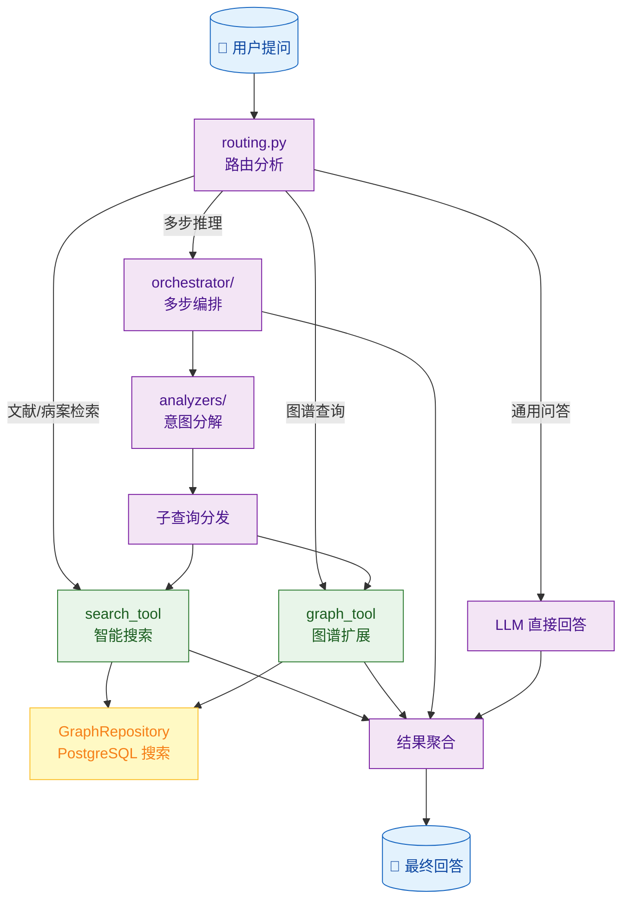
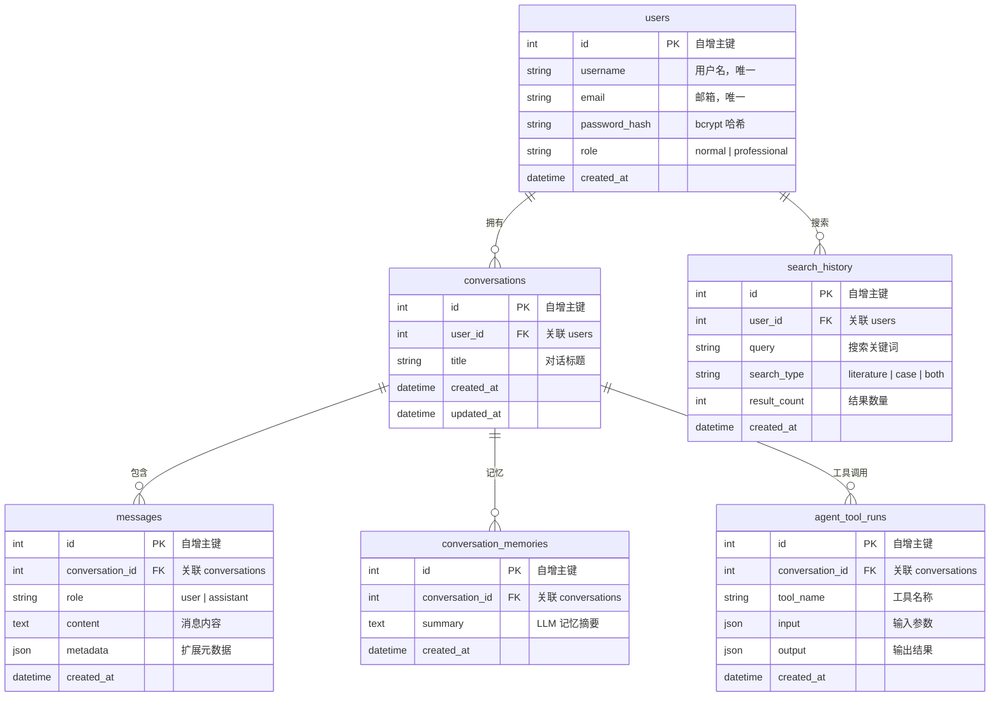
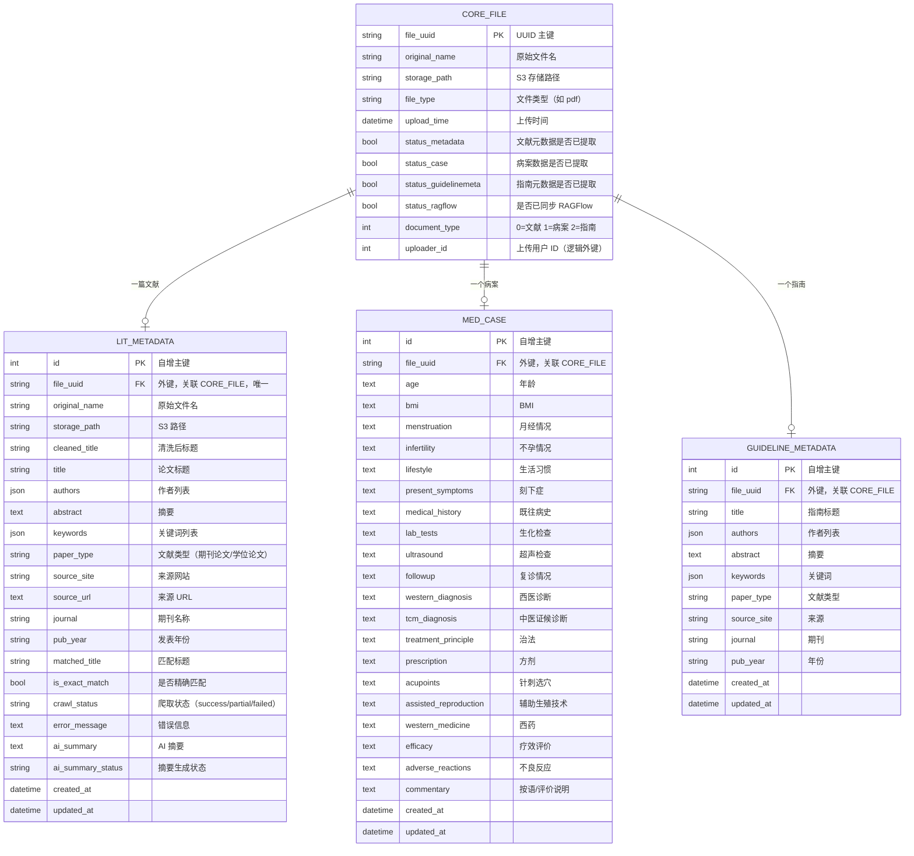
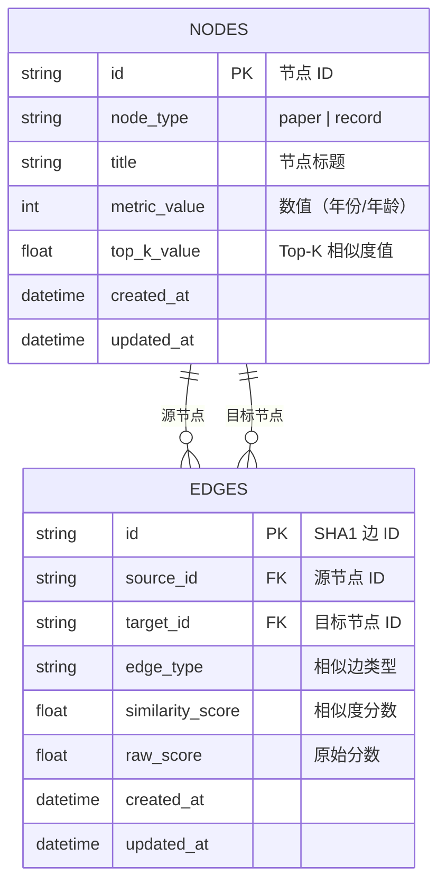

# 中医大模型智能体与知识图谱平台（TCM-Agent Graph Platform）

**TCM-Agent** 融合 **数据处理**、**知识图谱呈现** 与 **Agent 智能对话** 三大能力，面向中医领域的高价值知识抽取与智能问答。

**核心业务痛点**：将海量非结构化的中医文献与临床病案自动化提炼为结构化医疗实体，通过知识图谱进行可视化串联，并最终由 Agent 对话系统为医生/科研人员提供智能问答与辅助诊疗。

**技术栈**：Python、FastAPI、SQLAlchemy、Vue 3、Vite、AntV G6、PostgreSQL、对象存储(S3/COS)、LLM（大模型）。

## 快速启动

### 环境准备

项目需要 **Python 3.10+**。当前推荐使用 `Tcm-agent` conda 环境。

```bash
# 创建环境（包含所有依赖）
conda env create -f environment.yml
conda activate Tcm-agent

# 安装 Playwright 浏览器（如需使用爬虫功能）
playwright install chromium

# 前端依赖
cd UI/frontend && npm install
```

### 初始化数据库

```bash
python scripts/init_db.py
```

### 启动后端

```bash
cd UI/backend
uvicorn main:app --reload --host 0.0.0.0 --port 8011
```

### 启动前端

```bash
cd UI/frontend
npm run dev
```

访问 http://localhost:5500，注册账号后即可使用。

### 测试账号

先初始化数据库，再通过 CSV 批量创建用户：

```bash
# 1. 初始化数据库表
python scripts/init_db.py

# 2. 批量导入用户（参考 scripts/users.csv.example 准备 CSV）
python scripts/import_users.py scripts/users.csv
```

## 核心业务数据流

### 阶段一：数据处理层（Data Processing）

1. 用户上传文档至对象存储
2. 触发后台解析流程
3. 调用大模型抽取中医实体
4. 结构化结果写入 PostgreSQL 核心表
5. 通过 ETL 脚本建模生成图谱底表（Nodes/Edges）



### 阶段二：KG 图谱应用层（Knowledge Graph）

FastAPI 后端从 PostgreSQL 读取 Nodes/Edges，提供 BFS 扩展与详情查询接口；前端使用 AntV G6 实现交互式力导向图渲染，支持分层扩展、高亮聚焦、节点搜索。



**图谱交互流程**：
1. 用户点击节点或输入搜索词，前端调用 `/api/graph/expand?seed_id=xxx&depth=N`
2. 后端 BFS 遍历 `edges` 表，收集可达节点
3. 前端 G6 增量渲染，支持滑块控制保留扩展层数
4. 点击节点显示详情面板，支持 PDF 预览下载

### 阶段三：Agent 对话系统（Agent Dialogue System）

基于 LLM 的智能问答系统，通过多工具协同实现中医领域的语义理解与知识检索。



**对话流程说明**：
1. 用户输入自然语言问题
2. `routing.py` 分析问题意图，路由到对应工具
3. **search_tool**：对 PostgreSQL 执行全文/模糊搜索，返回匹配的文献和病案
4. **graph_tool**：查询知识图谱节点，获取关联路径
5. **orchestrator**：复杂问题拆分为多步子查询，逐步推理
6. 所有工具结果汇集到 LLM，生成最终回答

**对话管理**：
- `conversations` 表维护多轮对话上下文
- `conversation_memories` 存储 LLM 记忆摘要
- `messages` 记录每条消息的 role 和 content
- Agent 工具调用轨迹写入 `agent_tool_runs` 表

---

## 项目目录与架构映射

```
.
├── UI                              # 用户界面
│   ├── backend                     # 后端 FastAPI 应用
│   │   ├── main.py                 # 入口（路由注册、S3/G6 初始化）
│   │   └── app/
│   │       ├── config.py           # 环境变量配置
│   │       ├── core/database.py    # PostgreSQL 同步/异步引擎
│   │       ├── auth/               # 认证模块（JWT + bcrypt）
│   │       ├── models/             # SQLAlchemy ORM 模型
│   │       ├── schemas/            # Pydantic 请求/响应模型
│   │       ├── routers/            # API 路由
│   │       ├── services/           # 业务逻辑层
│   │       ├── repositories/       # 数据访问层
│   │       └── storage/            # S3 对象存储客户端
│   └── frontend                    # 前端 Vue 3 应用
│       ├── src/
│       │   ├── api/                # 后端 API 调用
│       │   ├── components/         # 通用组件（GraphView、ChatInput 等）
│       │   ├── views/              # 页面组件（Graph、Search 等）
│       │   ├── stores/             # Pinia 状态管理
│       │   └── router/             # 路由配置
│       └── ...                     # Vite 构建配置
├── agent                           # Agent 对话系统
│   ├── routing.py                  # 问题路由与意图识别
│   ├── orchestrator/               # 多步推理编排
│   ├── analyzers/                  # 查询意图分解
│   ├── services/                   # LLM 客户端、答案生成
│   ├── prompts/                    # LLM Prompt 模板
│   ├── tools/                      # Agent 工具（search、graph、validate）
│   └── memory/                     # 对话记忆管理
├── data_process                    # 离线数据处理脚本
│   ├── lit_metadata/               # 文献元数据爬取
│   ├── case_metadata/              # 病案大模型提取
│   ├── graph_builder/              # Nodes/Edges 离线建图
│   ├── ai_summary/                 # AI 摘要生成
│   ├── ragflow_sync/               # RAGFlow 文档同步
│   ├── guideline_metadata/         # 指南元数据
│   ├── pdf_upload/                 # TUI 上传工具
│   └── db_init.py                  # 数据库表初始化
├── scripts                         # 管理脚本
│   ├── init_db.py                  # 初始化所有数据库表
│   ├── import_users.py             # 从 CSV 批量导入用户
│   └── users.csv.example           # 用户导入模板
├── docker-compose.yaml
├── docker/
└── docs/
```

### 数据处理入口

数据库表结构初始化（业务表 + 图谱表）：

```bash
python scripts/init_db.py
```

离线生成图谱底表 `nodes` / `edges`：

```bash
python -m data_process.graph_builder.main
```

### 终端上传工具 (TUI)

TUI 是一个独立的命令行客户端，运行在本地电脑，通过 HTTPS+JWT 连接到部署在云服务器的 UI/backend：

```bash
# 1. 配置 API 地址
export TCM_API_BASE_URL=https://api.example.com:8011

# 2. 启动 TUI（首次会要求登录）
python data_process/pdf_upload/pdf_manager_tui.py
```

## 数据库建模

所有表均位于同一 PostgreSQL 数据库，按功能域分为三组。

**初始化方式**：
- 所有表通过 `python scripts/init_db.py` 统一创建（幂等，可重复执行）
- 图谱数据需额外通过 `python -m data_process.graph_builder.main` 离线构建填充

### 1. 用户与对话



### 2. 文献与病案



### 3. 知识图谱



---

## 后端 API 总览

| 模块 | 路径 | 说明 | 权限 |
|------|------|------|------|
| 认证 | `POST /api/auth/register` | 注册 | 公开 |
| 认证 | `POST /api/auth/login` | 登录 | 公开 |
| 对话 | `GET/POST /api/chat/conversations` | 对话 CRUD | 登录 |
| 对话 | `GET/POST /api/chat/conversations/{id}/messages` | 消息读写 | 登录 |
| 搜索 | `POST /api/search` | 智能搜索（全文+筛选+Facet） | 专业用户 |
| 搜索 | `GET /api/search/history` | 搜索历史 | 登录 |
| 图谱 | `GET /api/graph/expand` | BFS 扩展 | 登录 |
| 图谱 | `GET /api/graph/node-detail` | 节点详情 | 登录 |
| 图谱 | `GET /api/graph/search` | 图谱节点搜索 | 登录 |
| 图谱 | `GET /api/graph/file-url/{node_id}` | PDF 访问链接 | 登录 |
| 文件 | `POST /api/files/upload` | 单文件上传 | 登录 |
| 文件 | `POST /api/files/batch-upload` | 批量上传 | 登录 |
| 文件 | `DELETE /api/files/{file_uuid}` | 文件删除 | 登录 |
| 管理 | `GET/PUT /api/admin/{table}/{id}` | 元数据编辑 | 管理员 |
| 管理 | `DELETE /api/admin/lit/{id}` | 删除文献（级联删除病案+文件） | 管理员 |
| 管理 | `DELETE /api/admin/case/{id}` | 删除病案（不影响文献） | 管理员 |

---

## 环境变量

| 变量 | 默认值 | 说明 |
|------|--------|------|
| `JWT_SECRET_KEY` | tcm-agent-secret-key... | JWT 签名密钥 |
| `JWT_EXPIRE_MINUTES` | 1440 | Token 过期时间（分钟） |
| `POSTGRES_HOST` | 127.0.0.1 | PostgreSQL 地址 |
| `POSTGRES_PORT` | 5432 | PostgreSQL 端口 |
| `POSTGRES_USER` | postgres | PostgreSQL 用户名 |
| `POSTGRES_PASSWORD` | (空) | PostgreSQL 密码 |
| `POSTGRES_DB` | postgres | PostgreSQL 数据库名 |
| `S3_ENDPOINT` | https://cos.ap-beijing.myqcloud.com | 对象存储地址 |
| `S3_ACCESS_KEY` | (空) | SecretId |
| `S3_SECRET_KEY` | (空) | SecretKey |
| `S3_BUCKET_NAME` | tcm-documents-xxx | COS 存储桶名 |
| `S3_REGION` | ap-beijing | COS 地域 |
| `SEARCH_BACKEND_MODE` | auto | 搜索后端（auto/fulltext/like） |
